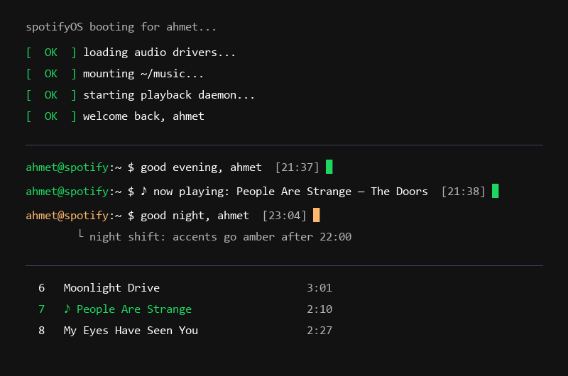

# Terminal Greeting

by [fdeox](https://github.com/fdeox) — a [Spicetify](https://spicetify.app) extension that gives your Spotify home page a terminal soul:

```
ahmet@spotify:~ $ good evening, ahmet  [21:37] █
ahmet@spotify:~ $ ♪ now playing: People Are Strange — The Doors  [21:37] █
```



## Features

- **Terminal prompt on the home page** — greets you by name, follows the time of day
  (`good morning` / `good afternoon` / `good evening` / `good night`), shows a live
  clock and a blinking block cursor.
- **Now-playing ticker** — the prompt rotates every 8 seconds between the greeting
  and `♪ now playing: track — artist`, updating instantly on song change.
- **Playing-track marker** — the current track is highlighted with your accent color
  and a `♪` prefix in every tracklist (playlists, albums, artist pages), no matter
  where playback started.
- **Night shift** *(off by default)* — between 22:00 and 05:00 your accent colors
  soften into a warm amber, and switch back in the morning.
- **Fake boot screen** — a 2.5-second `[  OK  ] mounting ~/music...` boot log when
  Spotify starts. Click it to skip. Pure vibes.

Everything is configurable from **Profile menu → Terminal Greeting settings**:
your name, and a toggle for each feature.

**Made for the [text](https://github.com/spicetify/spicetify-themes/tree/master/text)
theme** — this extension was born inside a text-theme setup and that's where it
looks most at home: the prompt sits right under the ASCII banner like a real
shell session. It only uses your theme's `--spice-*` colors though, so it works
fine on any other Spicetify theme too.

## Install

### Marketplace

Search for **Terminal Greeting** in the Spicetify Marketplace and click install.

### Manual

```
# copy terminal-greeting.js into your spicetify Extensions folder, e.g. on Windows:
#   %appdata%\spicetify\Extensions\terminal-greeting.js
spicetify config extensions terminal-greeting.js
spicetify apply
```

## Uninstall

```
spicetify config extensions terminal-greeting.js-
spicetify apply
```

## Credits

Born from a late-night theming session — the greeting, the boot log and the night
shift all started as personal customizations that were too fun not to share.
